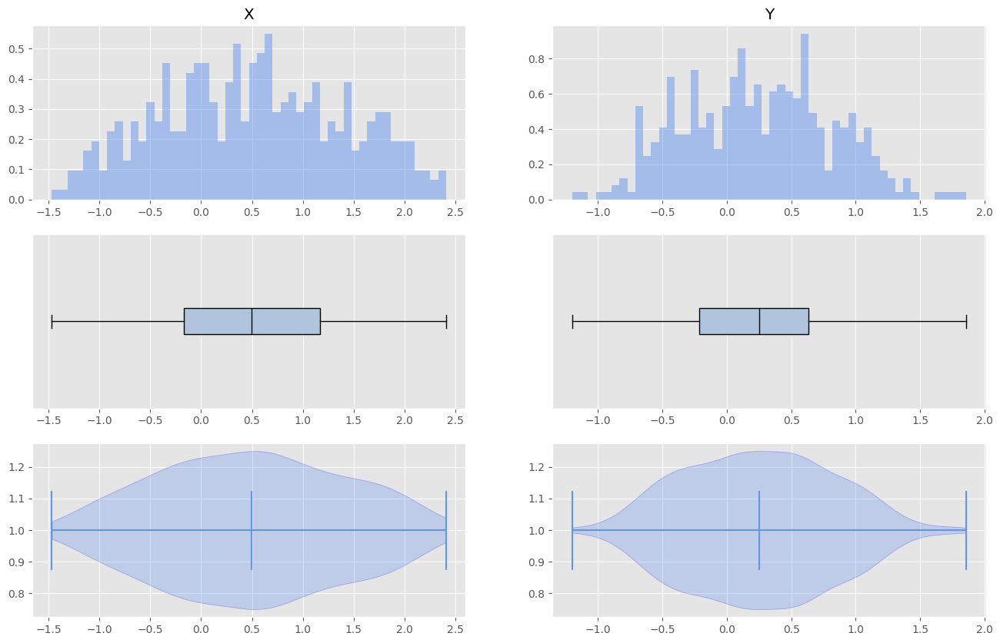

# Machine Learning Module: KNN Classifier



## Описание проекта

Этот проект представляет собой модуль для научных вычислений и анализа данных, включающий:

- Утилиты для предобработки данных
- Алгоритмы классификации (KNN и взвешенный KNN)
- Функционал для визуализации данных
- Метрики оценки качества алгоритмов
- Анимацию работы алгоритмов

## Структура проекта

```
ml_module/
├── data/                # Модуль для работы с данными
│   ├── preprocessing.py # Функции предобработки
│   └── visualization.py # Визуализация данных
├── models/              # Модели машинного обучения
│   ├── knn.py           # KNN и WeightedKNN
│   └── metrics.py       # Метрики качества
├── utils/               # Вспомогательные утилиты
│   ├── animations.py    # Анимации
│   └── helpers.py       # Вспомогательные функции
├── demo.py              # Демонстрация работы
└── tests/               # Тесты
```

## Установка и требования

1. Убедитесь, что у вас установлен Python 3.8+
2. Установите зависимости:

```bash
pip install numpy matplotlib scikit-learn
```

## Использование

### Быстрый старт

Запустите демонстрационный скрипт:

```bash
python demo.py
```

### Основные компоненты

1. **Визуализация данных**:

```python
from ml_module.data.visualization import visualize_distribution, DiagramTypes, AxisNames

visualize_distribution(
    points,
    diagram_type=[DiagramTypes.Violin, DiagramTypes.Hist],
    diagram_axis=[AxisNames.X, AxisNames.Y]
)
```

2. **Предобработка данных**:

```python
from ml_module.data.preprocessing import train_test_split, get_boxplot_outliers

X_train, y_train, X_test, y_test = train_test_split(points, labels)
outliers = get_boxplot_outliers(data, key=lambda x: x)
```

3. **Классификация**:

```python
from ml_module.models.knn import KNearestNeighbors, WeightedKNearestNeighbors

knn = KNearestNeighbors(n_neighbors=5)
knn.fit(X_train, y_train)
predictions = knn.predict(X_test)
```

4. **Оценка качества**:

```python
from ml_module.models.metrics import accuracy

acc = accuracy(y_test, predictions)
```

5. **Анимация**:

```python
from ml_module.utils.animations import AnimationKNN

animator = AnimationKNN()
animation = animator.create_animation(knn, X_test, y_test, "animation.gif")
```

## Тестирование

Для запуска тестов:

```bash
pytest tests/
```

